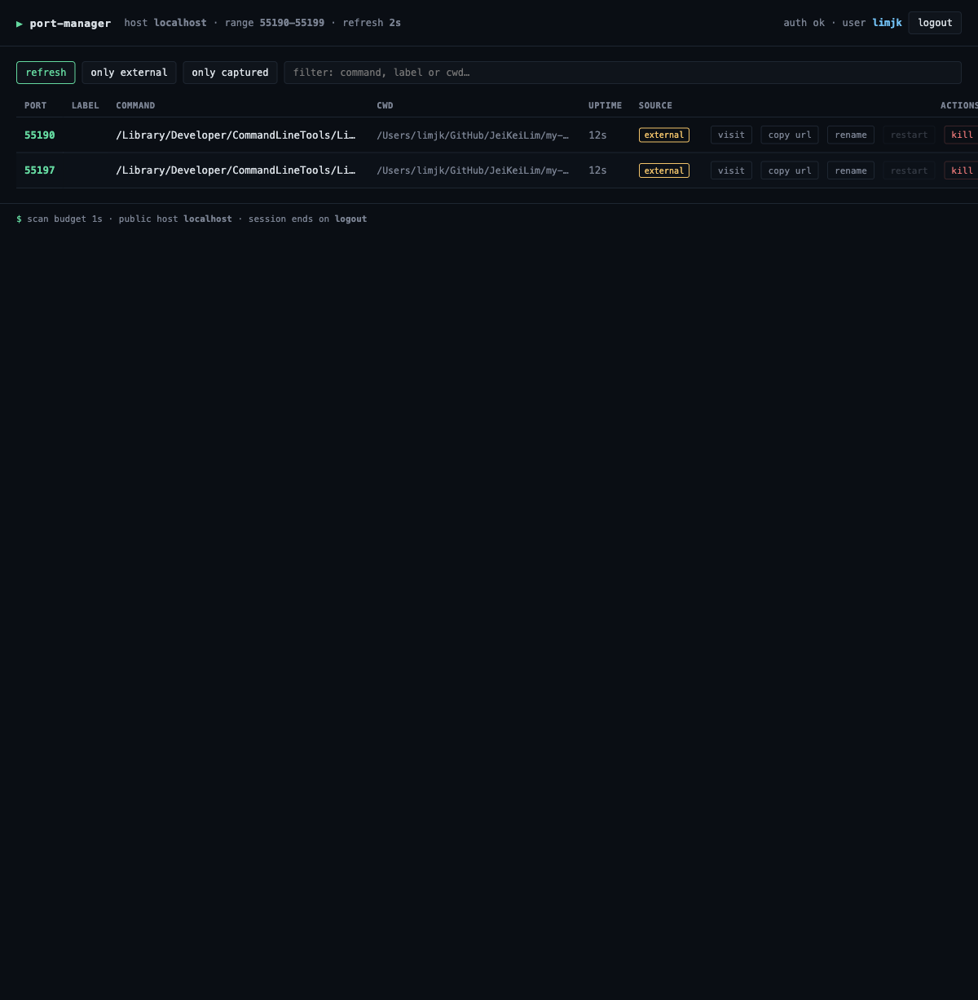

# port-manager

A single-binary macOS dashboard that discovers every user-owned TCP
listener in a configurable port-forwarded range (default
**40000–40500**) on your MacBook and exposes them through one
authenticated URL with management
actions: visit, copy URL, copy cwd, rename (persistent label),
restart (from a remembered killed entry), and kill (SIGTERM →
SIGKILL).

Replaces the workflow of juggling `lsof`, `ps`, and history-search
across terminal tabs.



> Design reference (chosen mockup):
> [`.tenet/visuals/2026-04-17-01-mockup-terminal-dark.html`](.tenet/visuals/2026-04-17-01-mockup-terminal-dark.html)
> — open in a browser to see the static palette.
> The screenshot above (`docs/screenshot.png`) is captured from the
> running binary against a real listener seeded inside the
> `40190–40199` sub-range.

Authoritative documents:

- Spec: [`.tenet/spec/2026-04-17-port-manager.md`](.tenet/spec/2026-04-17-port-manager.md)
- Harness / quality contract: [`.tenet/harness/current.md`](.tenet/harness/current.md)
- Design tokens: [`.tenet/DESIGN.md`](.tenet/DESIGN.md)
- Scenarios (acceptance): [`.tenet/spec/scenarios-2026-04-17-port-manager.md`](.tenet/spec/scenarios-2026-04-17-port-manager.md)

## Built autonomously

This project was shipped end-to-end by the **tenet** autonomous dev
pipeline (a separate project under development) as a real-world
validation run. Headline numbers:

| | |
|---|---|
| Wall clock (first tenet action → DAG complete) | **13.0 h** |
| Autonomous active time (minus 3 quota-reset pauses) | **≈ 9.5 h** |
| Jobs completed / blocked | **88 / 0** |
| Real jobs (12 core DAG + 2 ad-hoc fixes) | 14 |
| Auxiliary jobs (code + test + playwright critics per real job) | 74 |
| Real jobs that needed a retry | **10 / 14 (71 %)** |
| Worst case | 4 trials (mobile-safari locator + htmx stub replacement) |
| LoC at first commit | 19 406 across 139 files |

Full timing breakdown, retry pattern analysis, and tenet-pipeline
improvement notes live in
[`.tenet/journal/2026-04-18_run-stats-tenet-pipeline-validation.md`](.tenet/journal/2026-04-18_run-stats-tenet-pipeline-validation.md).
Every individual job's decision journal is under
[`.tenet/journal/`](.tenet/journal/); every research doc under
[`.tenet/knowledge/`](.tenet/knowledge/).

---

## Install

Requirements: **macOS 26 arm64** (or macOS 14/15 arm64 for CI),
**Go 1.24+** (minimum — transitive dependencies such as
`github.com/ebitengine/purego` ship files that require the 1.24
toolchain; the `go.mod` `go`/`toolchain` directives pin this),
`git`, `make`, `curl`. CGO is required on darwin
(`xcode-select --install` if not already present).

```bash
git clone https://github.com/JeiKeiLim/my-home-index-server.git
cd port-manager
cp .env.example .env        # then edit AUTH_TOKEN / PUBLIC_HOST
make build                  # produces ./port-manager (CGO on)
```

The `make build` target compiles `./cmd/port-manager` with the version
string baked in via `-ldflags -X main.version=$(VERSION)`. `VERSION`
defaults to `git describe --tags --always --dirty`, falling back to
`dev-YYYYMMDD` if there's no git history.

```bash
./port-manager --version
# → port-manager v0.1.0   (or dev-20260417 from a tarball checkout)
```

## Configure for your home

Before running, edit the two deployment-specific defaults in `.env`:

1. **`PUBLIC_HOST`** — the hostname copied-URL buttons advertise
   (e.g. `your-router.example.com`, or a subdomain that points at
   your home IP). The default `yourhost.example` is an RFC 6761
   reserved placeholder that never resolves; set this before you
   hand out copied URLs.
2. **`PORT_RANGE`** — the inclusive `<min>-<max>` window the
   scanner surfaces. The default `40000-40500` is a neutral
   example. Pick a range that matches your own router's
   port-forward rules (a 500-port span is typical).

Everything else (`AUTH_TOKEN`, `SESSION_SECRET`) auto-generates
on first run.

## Run

```bash
./port-manager                                   # uses .env defaults
./port-manager --port 40010                      # override listen port
./port-manager --public-host your.host.example   # override copied-URL host
```

On the first run the binary auto-generates a 32-byte `AUTH_TOKEN`
**and** `SESSION_SECRET` if either is empty in `.env`, prints the
generated `AUTH_TOKEN` to stdout exactly once, and persists both
values back to `.env` so subsequent runs reuse them. Save that
banner — there is no recovery path other than wiping `.env` and
starting over.

Open `http://localhost:40000/login` (or your configured `PORT`),
paste the token from `.env`, and you land on the dashboard.

```bash
# bearer-auth from scripts:
curl -H "Authorization: Bearer $(grep ^AUTH_TOKEN .env | cut -d= -f2)" \
  http://localhost:40000/ports.json
```

## Configuration

All variables can be set in `.env` (the binary reads `.env` at
startup; missing file is tolerated) or as process environment. CLI
flags override both. Defaults match `.env.example`.

| Variable          | Flag              | Default              | Notes |
|-------------------|-------------------|----------------------|-------|
| `AUTH_TOKEN`      | —                 | _(auto-generated)_   | Bearer token AND login-form password. ≥16 chars. Auto-generated 32-byte hex on first run, persisted to `.env`. |
| `SESSION_SECRET`  | —                 | _(auto-generated)_   | HMAC key for `pm_session` cookies. ≥16 chars. Rotating it invalidates all sessions. |
| `PUBLIC_HOST`     | `--public-host`   | `yourhost.example`   | Hostname used in copied URLs (e.g. `http://<host>:<port>/`). Placeholder — set this to your own router hostname. |
| `PORT`            | `--port`          | `40000`              | TCP port the dashboard binds (`0.0.0.0:PORT`). |
| `PORT_RANGE`      | —                 | `40000-40500`        | Inclusive `<min>-<max>` window the scanner surfaces and actions may target. Pick a range matching your own router's port-forward rules. |
| `KILL_GRACE_MS`   | `--kill-grace-ms` | `3000`               | Milliseconds the kill handler waits between SIGTERM and SIGKILL escalation. |
| `SCANNER`         | `--scanner`       | `auto`               | `auto` → libproc on darwin, else `lsof`. Force the subprocess fallback with `lsof`. |
| `STATE_DIR`       | `--state-dir`     | `~/.port-manager`    | Directory for `state.json` (labels + remembered killed entries). |
| `TRUST_XFF`       | `--trust-xff`     | `false`              | Use the first hop of `X-Forwarded-For` as the rate-limit / login-IP key instead of `RemoteAddr`. **Only enable behind a trusted reverse proxy** (Caddy/nginx) that always rewrites the header — see security note below. |
| —                 | `--env-file`      | `.env`               | Path to the env file Load reads + persists generated secrets to. |
| —                 | `--version`       | —                    | Print version (baked via `-ldflags -X main.version=…`) and exit. |

The full `.env.example` template (with comments) lives at the repo root.

## Make targets

| Target    | What it runs |
|-----------|--------------|
| `build`   | `go build -ldflags "-X main.version=…" -o port-manager ./cmd/port-manager`. CGO on. |
| `test`    | `go test -race -shuffle=on ./...` |
| `lint`    | `gofmt -s -l .`, `go vet ./...`, `golangci-lint run --timeout=60s` (pinned at `v1.62.2`). |
| `smoke`   | Runs [`scripts/smoke.sh`](scripts/smoke.sh): builds, starts the binary, hits `/healthz` and `/ports.json`, sends SIGTERM, asserts a clean exit. |
| `e2e`     | `cd tests/acceptance/e2e && npm ci && npx playwright install --with-deps chromium && npx playwright test`. |
| `release` | Cross-compiles a trimmed + stripped binary into `dist/port-manager-darwin-arm64` (`-trimpath -ldflags "-s -w -X main.version=…"`). |
| `clean`   | Removes `./port-manager`, `./dist/`, and any leftover smoke pid/log files. |
| `version` | Prints the resolved `VERSION` string. |

A clean checkout should pass:

```bash
make build && make test && make lint && ./scripts/smoke.sh
```

## Scripts

- [`scripts/smoke.sh`](scripts/smoke.sh) — the canonical smoke check
  invoked by `make smoke` and CI. Builds the binary, starts it on
  `:40010` (override with `SMOKE_PORT`) with `AUTH_TOKEN=smoketest-…`,
  curls `/healthz` (unauthenticated) and `/ports.json` (bearer-auth'd),
  sends `SIGTERM`, and asserts exit status `0` or `143`. Tunables:
  `SMOKE_PORT`, `SMOKE_TOKEN`, `SMOKE_SECRET`, `SMOKE_TIMEOUT`.

## Continuous integration

[`.github/workflows/ci.yml`](.github/workflows/ci.yml) runs on every
push and pull request against `main`. The workflow pins
`runs-on: macos-15` because the libproc cgo scanner has no Linux
stub — cross-compilation onto Linux runners is intentionally not
supported (spec §10, harness §off-device CI). The job:

1. Checks out, installs Go `1.24.x` and Node `20`.
2. Installs the pinned `golangci-lint v1.62.2`.
3. Runs `gofmt -s -l .`, `go vet ./...`, `golangci-lint run`.
4. Runs `go test -race -shuffle=on ./...`.
5. Runs `make build` — host arm64 binary with CGO on (consumed by
   the smoke check in step 8).
6. Runs `make release` — cross-trimmed/stripped build into
   `dist/port-manager-darwin-arm64`.
7. Verifies the release artifact is an arm64 Mach-O binary
   (`test -f dist/port-manager-darwin-arm64` plus `file … | grep arm64`
   and `file … | grep -i mach-o`).
8. Runs `./scripts/smoke.sh` against the host binary from step 5.
9. `cd tests/acceptance/e2e && npm ci && npx playwright install --with-deps chromium && npx playwright test`.
10. Uploads the Playwright HTML report on failure.

## Security notes

The MVP serves **plain HTTP** on `0.0.0.0:PORT`. There is no
TLS termination inside the binary. If you expose the dashboard
beyond your LAN — e.g. on `your.host.example` via your home router's
port-forward — put it behind a reverse proxy that terminates TLS:

```caddy
your.host.example {
    encode zstd gzip
    reverse_proxy 127.0.0.1:40000
}
```

The same advice applies to nginx/Traefik/Cloudflare Tunnel — pick
whichever you already operate. The dashboard sets `Secure=false`
on the `pm_session` cookie because it cannot detect its own
upstream protocol; running it without a TLS-terminating proxy on a
public hostname leaks the bearer token in transit.

**Token rotation.** To rotate `AUTH_TOKEN`, edit `.env`, replace the
value with a new ≥16-char string, and restart the binary. To force
a fresh auto-generated 32-byte hex token, blank the `AUTH_TOKEN=`
line and restart — the new token is printed once to stdout and
persisted back to `.env`. Rotating `SESSION_SECRET` the same way
invalidates every existing browser session, forcing a re-login.

Other guarantees enforced by the binary (see harness §Iron Laws):

- Constant-time bearer-token compare (`crypto/subtle`).
- Self-PID is filtered at the scanner AND rejected at the kill
  handler — two guards.
- Only same-uid listeners are surfaced; only same-uid PIDs may be
  killed.
- All actions validate `port ∈ [PortMin, PortMax]` server-side.
- `Authorization`, `Cookie: pm_session`, and the env values for
  `AUTH_TOKEN` / `SESSION_SECRET` are redacted from structured logs.
- Rate-limit: 5 failed logins per remote IP per 15-minute sliding
  window → `429` lockout for the remainder of the window. Successful
  logins reset the counter for that IP.

**`TRUST_XFF` (default off).** When enabled, the rate-limiter and
login handler derive the remote-IP key from the first hop in
`X-Forwarded-For` instead of the TCP peer address. This is the
correct setting **only when the binary sits behind a reverse proxy
that always rewrites `X-Forwarded-For`** (Caddy, nginx, Traefik,
Cloudflare Tunnel, etc.). On a naked HTTP listener exposed to the
network, `TRUST_XFF=true` lets any caller spoof the header to
allocate a fresh rate-limit bucket per request and bypass the
`5/15min` lockout entirely. Keep the flag off unless your proxy
strips the inbound header before injecting its own. The Playwright
e2e harness sets `TRUST_XFF=true` because each test rotates a unique
header and the binary listens only on `localhost` — that
configuration is for tests only.

## This deliberately does NOT

- **Launch new commands.** There is no `POST /launch` endpoint and
  no code path that constructs an `exec.Cmd` from user-provided
  argv. The only way the dashboard spawns a process is `restart`,
  which replays a `(command, cwd, env)` tuple captured from a kill
  it previously observed (no shell, no string interpolation).
- **Capture logs.** No stdout/stderr tail, no SSE log stream, no
  per-process `journalctl`-style buffer. If you need to read a
  process's logs, attach to its terminal directly.
- **Run on non-macOS.** Linux, Windows, FreeBSD, and pre-26 macOS
  builds are out of scope. The cgo libproc scanner has no
  cross-platform stub and the lsof fallback shells out to the
  macOS-flavoured `lsof` argv. Cross-compilation will fail at
  `go build` by design.

Other things explicitly excluded by spec §10: TLS in-binary,
multi-user / per-user views, UDP listeners, ports outside the
configured `PORT_RANGE`, persistent historical port database,
CPU/memory charts, QR codes, OAuth/OIDC/SSO, and launchd/brew
auto-start.

## Layout

```
.
├── cmd/port-manager/main.go    # wiring: config → store → scanner → server
├── internal/
│   ├── auth/                   # token compare, cookie sign, rate limit
│   ├── config/                 # .env + flag parsing
│   ├── inspector/              # gopsutil-based process metadata
│   ├── model/                  # Port, Remembered, ViewModel
│   ├── process/                # detached restart, SIGTERM→SIGKILL
│   ├── scanner/                # libproc (cgo, darwin) + lsof fallback
│   ├── server/                 # routes, middleware, render
│   └── store/                  # JSON labels + remembered, atomic write
├── web/                        # embedded htmx + templates + CSS tokens
├── tests/
│   ├── integration/            # spawn real listeners, exercise scan/kill
│   └── acceptance/e2e/         # Playwright (desktop-chromium + mobile-safari)
├── scripts/smoke.sh            # the canonical smoke check
├── .github/workflows/ci.yml    # macos-15 vet / lint / test / smoke / e2e
├── docs/screenshot.png         # in-binary dashboard capture
└── Makefile
```
